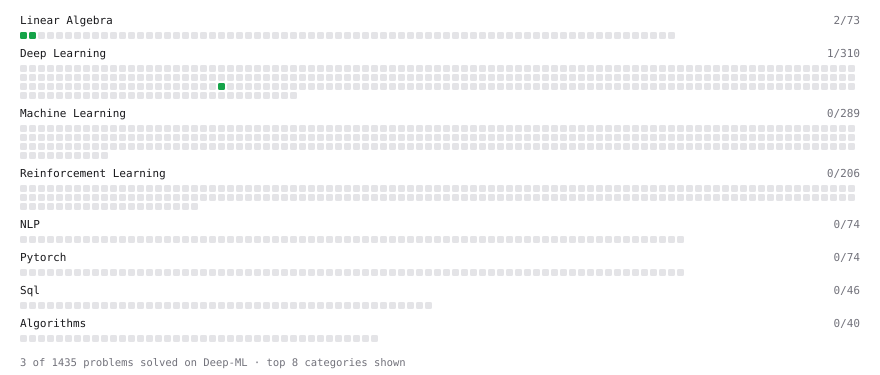

# Deep-ML

My machine learning practice from [Deep-ML](https://www.deep-ml.com). Every solution here was written by hand.

**6** solved · 4 problems · 0 labs · 2 math

[**Browse the interactive portfolio**](https://rohitdanda.github.io/deep-ml/) to replay this filling in over time.

## Problems

| | Difficulty | Solved | |
| --- | --- | --- | --- |
| [Embedding Layer as One-Hot Matrix Multiplication](https://www.deep-ml.com/problems/947) | easy | 2026-09-22 | [solution](problems/0947-embedding-layer-as-one-hot-matrix-multiplication) |
| [Matrix-Vector Dot Product](https://www.deep-ml.com/problems/1) | easy | 2026-09-22 | [solution](problems/0001-matrix-vector-dot-product) |
| [Reshape Matrix](https://www.deep-ml.com/problems/3) | easy | 2026-09-23 | [solution](problems/0003-reshape-matrix) |
| [Transpose of a Matrix](https://www.deep-ml.com/problems/2) | easy | 2026-09-23 | [solution](problems/0002-transpose-of-a-matrix) |

## Math

| | Difficulty | Solved | |
| --- | --- | --- | --- |
| [Matrix Basics](https://www.deep-ml.com/math-problems/9) | easy | 2026-09-16 | [solution](math/0009-matrix-basics) |
| [Vector Operations](https://www.deep-ml.com/math-problems/7) | easy | 2026-09-16 | [solution](math/0007-vector-operations) |

---

_This file is regenerated by Deep-ML on every push._
